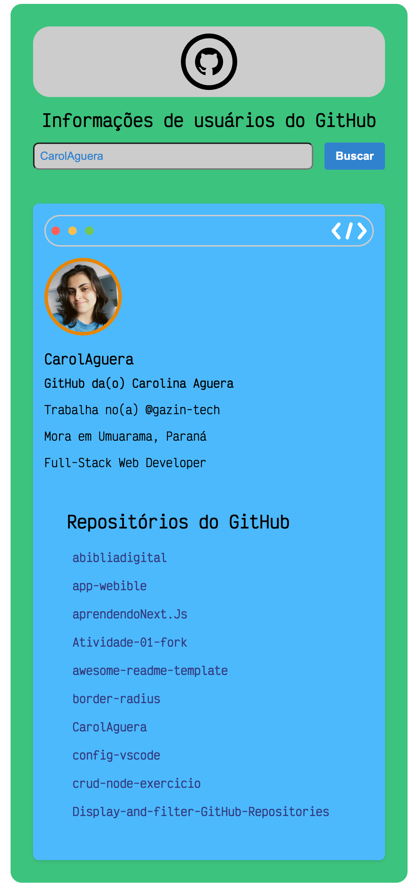

# 🚀 Projeto GitHub User Search

<p align="center">
  
</p>

O GitHub User Search é um projeto em Next.JS 13 que consome a API do GitHub para buscar informações de usuários com base no nome de usuário fornecido. O projeto é desenvolvido usando TypeScript e Styled Components para a estilização. Além disso, também utiliza React Virtualized para renderização otimizada da lista de repositórios públicos do usuário. O ESLint é configurado para garantir a consistência do código e o Axios é utilizado para fazer requisições à API do GitHub. 🤖

## Funcionalidades ⚙️

- Busca de usuários do GitHub por nome de usuário 🔍
- Exibição das informações do usuário encontrado, incluindo:
  - Nome
  - Foto do perfil 🖼️
  - Biografia
  - Local de trabalho
  - Local de residência 🏠
- Listagem de todos os repositórios públicos do usuário com renderização otimizada usando React Virtualized. 📚

## Pré-requisitos 🛠️

Certifique-se de ter o [Node.js](https://nodejs.org) instalado em sua máquina. 🖥️

## Instalação 🚀

1. Clone este repositório para o seu ambiente local:

```bash
git clone https://github.com/CarolAguera/github-user-search.git
```

2. Acesse o diretório do projeto:

```bash
cd github-user-search
```

3. Instale as dependências necessárias:

```bash
npm install
```

## Executando o projeto ▶️

Você pode iniciar o servidor de desenvolvimento localmente. Basta executar o seguinte comando:

```bash
npm run dev
```

Acesse `http://localhost:3000` em seu navegador para visualizar o aplicativo. 🌐

## Estrutura do Projeto 📂

A estrutura de diretórios do projeto é a seguinte:

```
.
├── components/
│   ├── ButtonsMacOs.tsx
│   ├── GitHubRepoList.tsx
│   └── User.tsx
├── icons/
│   ├── CodeIcon.tsx
│   └── GitHubIcon.tsx
├── services/
│   ├── get-repositories.ts
│   ├── get-user.ts
│   └──service-contract.ts
├── public/
│   ├── exemple.png
│   └── github.svg
├── .eslintrc.json
├── package.json
├── tsconfig.json
└── README.md
```

## Contribuições 🤝

Contribuições são bem-vindas! Se você encontrar algum problema ou tiver sugestões para melhorar o projeto, sinta-se à vontade para abrir uma issue ou enviar um pull request.

## Licença 📜

Este projeto está licenciado sob a [MIT License](LICENSE). 📄
